Desciprtion: `As a manager, I implemented a feedback system in our Webmin application to gather customer feedback and improve our services. However, during its implementation, the system Exposed some sensitive information of our employees. Could you help me identify and address these Common Vulnerabilities?`

### 1. Analysis first web application
- We have a feedback form. Let's check the source code first.

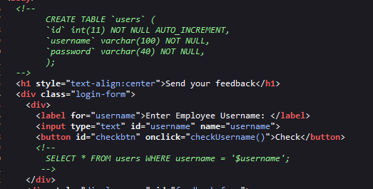

- We can see some comments about SQL query, most likely this web application has SQL injection vuln.
- Do a simple test with `'`.

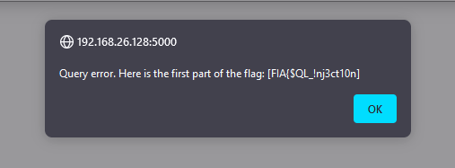
- That's great, looks like we're on the right track.
- Continue to try to dump table data from the database. It is Blind-SQL Injection, we can write a simple script to dump the data but we already have a tool - *sqlmap*. `(Try to make up a code that exploits the vulnerability to show that you are a pro or you will just be a script kiddie:)))`
- Here is sqlmap command:
```
sqlmap -u http://192.168.26.128:5000/api/check_username --method=POST --data '{"username":"admin"}' -p username --headers='Content-Type: application/json' --dump
```
- Output:

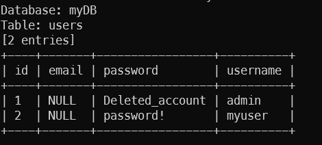
- Now we got credentials, let's go to Webmin.
After login, we got a notice that

 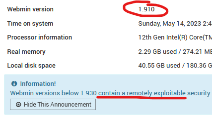
 - Search vuln for that webapp with this version, and we got a CVE `[CVE-2019-12840](https://cve.mitre.org/cgi-bin/cvename.cgi?name=CVE-2019-12840)`
 - We already know that it has a CVE, and the next simple work is find a POC to exploit that CVE. (https://github.com/KrE80r/webmin_cve-2019-12840_poc)
 - Here I built this server on my local machine so that I do not need to NAT port or use TCP Tunnel. If you are not in the same network with server, you can use some TCP Tunnel to forward the connection to your IP (Example: ngrok, localhost.run,...)
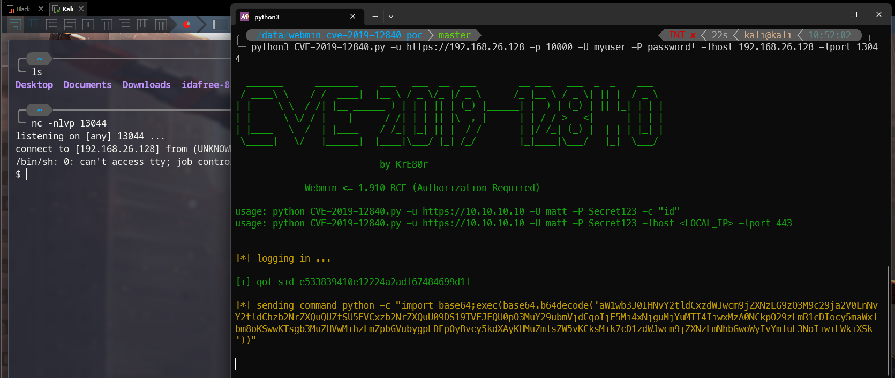
- After getting the shell, let's spawn tty shell first
```
python -c 'import pty; pty.spawn("/bin/bash")'
export TERM=xterm
```
- Look around, we got the 2nd part of the flag, but we are myuser, next step is become root.

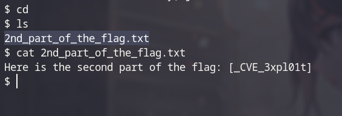
- We have a hint that `Can you find my shadow ???` Maybe relate to /etc/shadow, let's check.

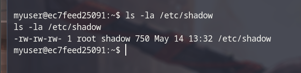
- We had read and write permission on `/etc/shadow`.
- In `shadow` file do not contain root password hash so we can not crack it, but we have write permission, try to make a password hash with `mkpasswd` then insert it into `shadow` file.
```
mkpasswd -m sha-512 new_password
```

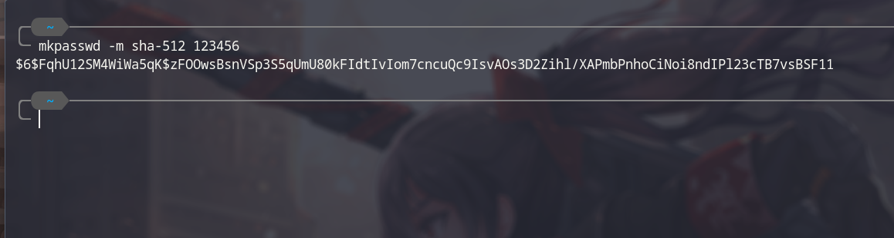
Next step: insert that hash into shadow file between 2 first semicolon. The result wil be like this:
```
root:password_hash:.....
```
- Text editors are really stupid, we can use sed -i or vim -c to replace the text.
```
Example command:
sec -i 's/old_text/new_text/g' /etc/shadow
or
vim -c '%s/old_text/new_text/g' -c 'q' /etc/shadow
```
*Note: Remember to escape some special character in password hash like $*

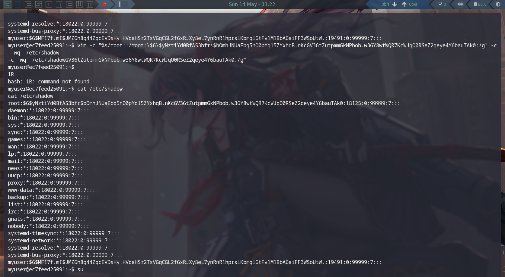
- Next step is login into root with you password, so ez :))

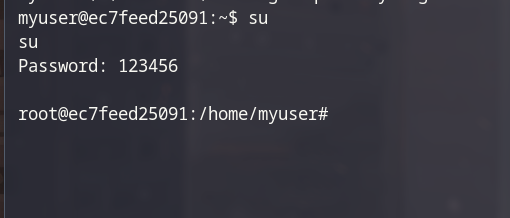
- Final step, read the flag

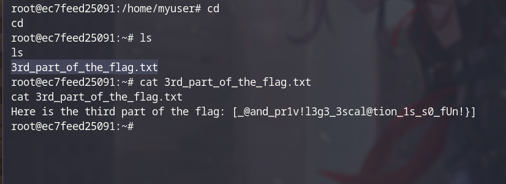

```
Flag: FIA{$QL_!nj3ct10n_CVE_3xpl01t_@and_pr1v!l3g3_3scal@tion_1s_s0_fUn!}
```
